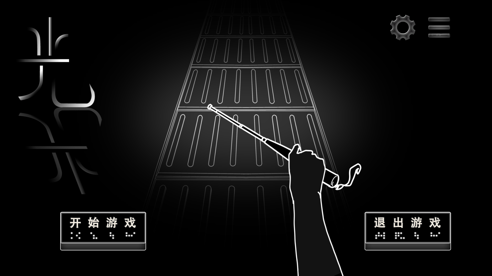

# Light 游戏

## 概览

**链接**: 
[学习通云盘](https://pan-yz.cldisk.com/external/m/file/1046115469885538304)

**游戏类型**: 剧情类角色扮演游戏

**游戏平台**: Windows

## 游戏简介

**Light** 是一款剧情向角色扮演游戏，旨在让玩家体验视觉障碍者的日常生活。游戏中，玩家将扮演一位后天视觉障碍者，通过改编现实生活中的新闻或故事，体验从失去光明到参加演唱会的旅程。

## 故事设计

- **背景**: 主角是一位音乐生，因后天原因成为视觉障碍者。
- **情节**: 主角计划去看喜欢的歌手的演唱会，在前往演唱会的途中会遇到各种障碍和挑战。
- **结局**: 经历种种困难后，主角最终到达演唱会现场。

## 游戏场景设计

1. **房间**: 包含钢琴、盲杖、吉他等，展现主角与音乐的深厚联系。
2. **道路**: 游戏的主要玩法关卡，玩家需要在这里克服障碍。
3. **演唱会**: 主角在工作人员的帮助下进入演唱会现场。

## 玩法设计

- **UI交互**: 通过点击UI照亮前路，每次点击都会发出盲杖导路的声音。
- **数值系统**: 包含血条、焦虑值和心跳值，影响玩家的游戏进程。
- **障碍**: 碰撞障碍会导致血条减少，血条归零则扣除心跳值并恢复部分血条。
- **焦虑值**: 离开盲道会导致焦虑值降低，直至游戏暂停。
- **心跳值**: 心跳值归零则需要重新开始当前道路。
- **投骰子**: 投出3点和6点可触发绿灯进入下一关卡，投骰子消耗心跳值。

## 人物与音乐设计

- **故事来源**: 取材自一位暑期去看演唱会的视觉障碍者的新闻报道。
- **音乐**: 游戏背景音乐和结束音乐选用钢琴版和林宥嘉版的《你是我的眼》。

## 游戏主旨

本游戏旨在提高公众对视觉障碍者群体的关注。中国有超过一千七百多万视觉障碍者，但导盲犬数量有限。我们希望通过这款游戏，让更多人了解并关注这一少数群体的日常生活和需求。

---

**注意**: 游戏下载链接指向的是一个大文件，下载前请确保有足够的存储空间。
